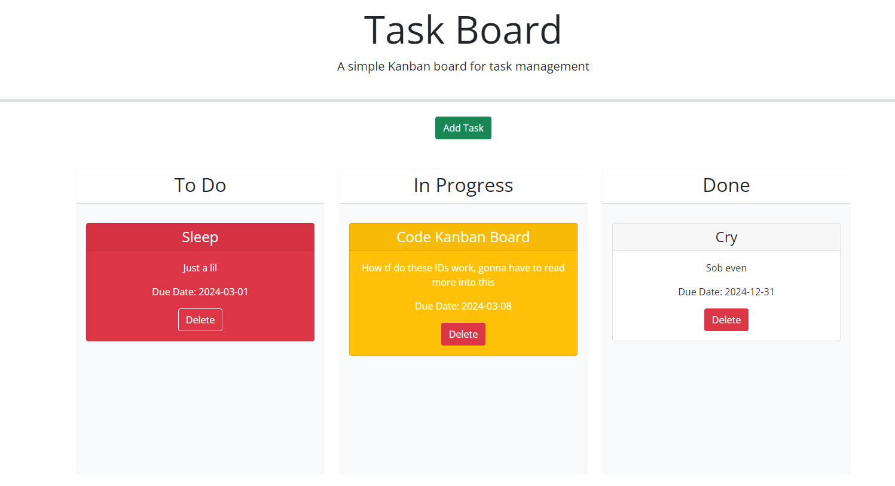

# c05-task-board

## Description

The goal of this was to fix the code provided so that the kanban board allows you to add a task by entering the task name, description, and due date. Once the task is added, the user is able to drag
the task where they desire on the board, and delete said task once it's no longer needed. The tasks will change color as well based off of their due dates (Yellow for due that day, red for past due).

I learned a lot about bootstrap and jQuery while working on this project, and feel like after this, though I might not fully understand all concepts I'm working with, I've gained a better understanding
overall and have learned how to research and troubleshoot the issues I have with these better.

## Table of Contents (Optional)

N/A

## Installation

N/A

## Usage

Select the "Add Task" button to add a task to the board. Select the "Delete" button to remove the desired task.

Upon adding a task, you will be prompted to enter a task name, description, and due date.

You can check this out [here](https://enkw.github.io/c05-task-board/)!

## Credits

Shouts out to the bootstrap 5.1.3 and jQuery documentation!

Special thanks to Bryan Lebeuf for continuing to helping me learn and grow as a developer.

Shouts out to me, Ian Wolfe

## License

N/A

## Badges

N/A

## Features

Track your tasks with this kanban board!

Tasks will appear yellow if they're due the day you're viewing the board, and red if the task is past due!

## How to Contribute

N/A

## Tests

N/A
